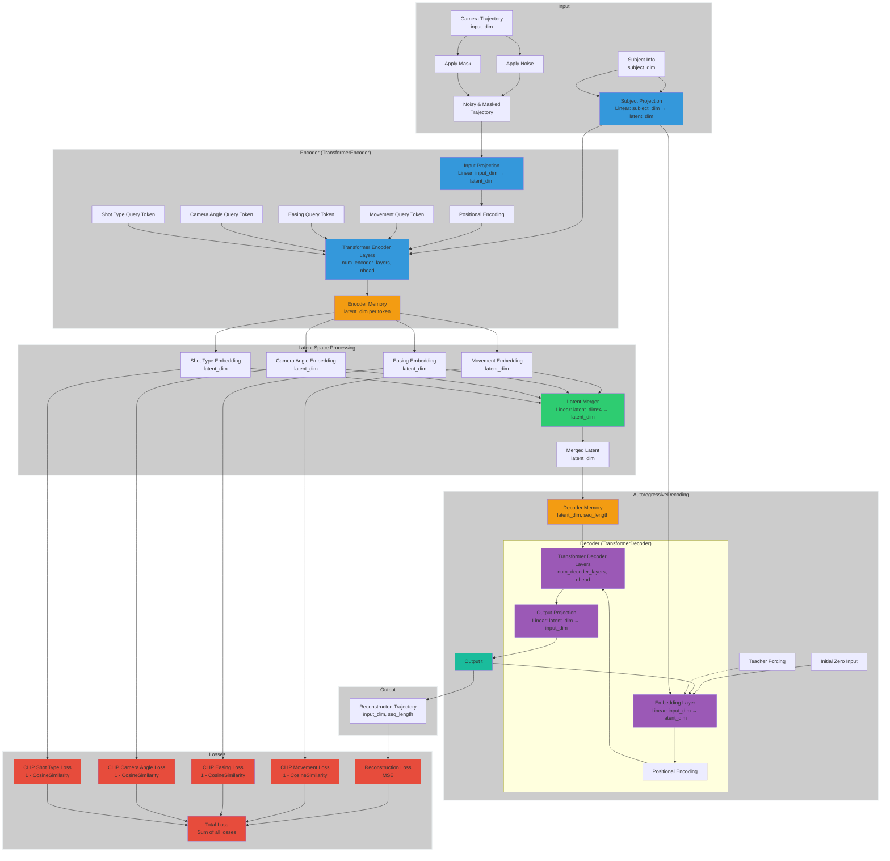

# LensCraft

This project implements an autoencoder model for camera trajectories using a multi-task architecture. The model learns to reconstruct camera movements based on subject information and initial trajectory data. In addition to producing accurate trajectory reconstructions, it generates embeddings for movement types, easing functions, camera angles, and shot types. These generated embeddings are designed to be aligned with CLIP (Contrastive Language-Image Pre-training) embeddings, allowing for better integration with language-based interfaces and multi-modal applications.

## Model Architecture


```mermaid
graph TD
    subgraph Input
        A[Camera Trajectory<br>input_dim] --> B[Apply Noise]
        A --> C[Apply Mask]
        B & C --> D[Noisy & Masked<br>Trajectory]
        S[Subject Info<br>subject_dim] --> SP[Subject Projection<br>Linear: subject_dim → latent_dim]
    end

    subgraph Encoder["Encoder (TransformerEncoder)"]
        E[Input Projection<br>Linear: input_dim → latent_dim]
        F[Positional Encoding]
        G[Transformer Encoder Layers<br>num_encoder_layers, nhead]
        H1[Movement Query Token]
        H2[Easing Query Token]
        H3[Camera Angle Query Token]
        H4[Shot Type Query Token]
        M1[Encoder Memory<br>latent_dim per token]
    end

    subgraph LatentSpace["Latent Space Processing"]
        I1[Movement Embedding<br>latent_dim]
        I2[Easing Embedding<br>latent_dim]
        I3[Camera Angle Embedding<br>latent_dim]
        I4[Shot Type Embedding<br>latent_dim]
        J[Latent Merger<br>Linear: latent_dim*4 → latent_dim]
        K[Merged Latent<br>latent_dim]
    end

    subgraph AutoregressiveDecoding
        subgraph Decoder["Decoder (TransformerDecoder)"]
            L[Embedding Layer<br>Linear: input_dim → latent_dim]
            M[Positional Encoding]
            N[Transformer Decoder Layers<br>num_decoder_layers, nhead]
            O[Output Projection<br>Linear: latent_dim → input_dim]
        end
        P[Initial Zero Input]
        Q[Teacher Forcing]
        R1[Output t]
        M2[Decoder Memory<br>latent_dim, seq_length]
    end

    subgraph Output
        R[Reconstructed Trajectory<br>input_dim, seq_length]
    end

    subgraph Losses
        S1[Reconstruction Loss<br>MSE]
        S2[CLIP Movement Loss<br>1 - CosineSimilarity]
        S3[CLIP Easing Loss<br>1 - CosineSimilarity]
        S4[CLIP Camera Angle Loss<br>1 - CosineSimilarity]
        S5[CLIP Shot Type Loss<br>1 - CosineSimilarity]
        T[Total Loss<br>Sum of all losses]
    end

    S --> SP
    SP --> G
    D --> E --> F --> G
    H1 & H2 & H3 & H4 --> G
    G --> M1
    M1 --> I1 & I2 & I3 & I4
    I1 & I2 & I3 & I4 --> J --> K
    K --> M2
    M2 --> N
    P --> L
    L --> M --> N
    N --> O --> R1
    R1 --> L
    Q -.-> L
    R1 --> R
    R --> S1
    I1 --> S2
    I2 --> S3
    I3 --> S4
    I4 --> S5
    S1 & S2 & S3 & S4 & S5 --> T
    SP --> L

    classDef subgraphStyle fill:#cccccc,stroke:#ecf0f1,stroke-width:2px;
    class Input,Encoder,LatentSpace,AutoregressiveDecoding,Output,Losses subgraphStyle;

    style E fill:#3498db
    style G fill:#3498db
    style J fill:#2ecc71
    style L fill:#9b59b6
    style N fill:#9b59b6
    style O fill:#9b59b6
    style M1 fill:#f39c12
    style M2 fill:#f39c12
    style R1 fill:#1abc9c
    style S1 fill:#e74c3c
    style S2 fill:#e74c3c
    style S3 fill:#e74c3c
    style S4 fill:#e74c3c
    style S5 fill:#e74c3c
    style T fill:#e74c3c
    style SP fill:#3498db

```

## Installation

1. Clone the repository **with submodules** (DIRECTOR, Camera-control and GenDoP live in `third_parties/`):
   ```bash
   git clone --recurse-submodules https://github.com/ZahraDehghanian97/LensCraft.git
   cd LensCraft
   # or, if already cloned:
   git submodule update --init --recursive
   ```

2. Create a virtual environment (optional but recommended):
   ```bash
   python -m venv venv
   source venv/bin/activate  # On Windows, use `venv\Scripts\activate`
   ```

3. Install the required packages:
   ```bash
   pip install -r requirements.txt
   ```
   > **Note:** `requirements.txt` pins `optuna==4.3.0`, which conflicts with the
   > dependency metadata of `hydra-optuna-sweeper==1.2.0` (it declares `optuna<3.0.0`).
   > If pip reports `ResolutionImpossible`, install the sweeper separately:
   > ```bash
   > grep -v '^hydra-optuna-sweeper' requirements.txt | pip install -r /dev/stdin
   > pip install --no-deps hydra-optuna-sweeper==1.2.0
   > ```

## Datasets

The project supports three datasets, selected at runtime via Hydra
(`config/data/dataset/{default,et,ccdm,multi}.yaml`). Paths are resolved from
environment variables (see [Configuration](#configuration)).

### Simulation (default)

Synthetic camera-trajectory simulations stored as msgpack files. Each simulation
includes camera frames, subject information (position, size, rotation), and
instructions (camera movement, easing, initial camera angle, initial shot type).
`data/simulation/dataset.py` handles loading and preprocessing.

Download (full dataset, or the smaller `-mini` variant for quick experiments):
```bash
pip install gdown
# full dataset
gdown 1VT2XfBj9LFWLUBjv65dzC4bVzH0zdNDU
# mini variant (sim-data.tar.zst, extracts to simulation-data-4-mini/)
gdown 1xxIPzvjTUuUOoVEZjhNeRDRluhbHNUq8
zstd -dc sim-data.tar.zst | tar -xf -
```
Point `SIMULATION_DATA_PATH` at the extracted directory.

### E.T. (Exceptional Trajectories)

Pulled from HuggingFace (~31 GB, requires `git-lfs`):
```bash
git clone https://huggingface.co/datasets/robin-courant/et-data /path/to/data/et-data
cd /path/to/data/et-data && sh untar_and_move.sh
```
Set `ET_DATA_DIR` to the clone and `DIRECTOR_PROJECT_DIR` to
`third_parties/DIRECTOR`. If you extract as root (e.g. in a container) and tar
fails with `Cannot change ownership`, extraction still succeeds — or pass
`--no-same-owner` to tar.

The cinematography instruction annotations for E.T. prompts are a separate
download:
```bash
gdown 1ZmC6EAcIcvdni6O1X8xpy1g1n_NRFtoR  # et_cinematography_instructions.json
```
Set `ET_CIN_LANG_PATH` to the downloaded JSON file.

### CCDM

Download and extract the CCDM data archive:
```bash
gdown 1Dazg2XMMmMmHl-dTe_7cf6RlDGHNqlN-  # ccdm-data.tar.zst
zstd -dc ccdm-data.tar.zst | tar -xf -
```
This produces a `ccdm/` directory containing `data.npy` and `Mean_Std.npy`;
set `CCDM_DATA_DIR` to it (the loader expects `$CCDM_DATA_DIR/data.npy`).
For evaluation against the pretrained CCDM model, place its checkpoint under
`third_parties/Camera-control/[2024][EG]Text+keyframe/` and set
`CCDM_CHECKPOINT_PATH`.

## GenDoP baseline

To run inference/evaluation against the pretrained
[GenDoP](https://github.com/3DTopia/GenDoP) model (`training/model=gendop`):

1. Install its extra dependencies (kept out of `requirements.txt` since they
   are only needed for this baseline):
   ```bash
   pip install diffusers==0.34.0 accelerate kiui tyro trimesh megfile
   ```
   > `diffusers>=0.35` is incompatible with the pinned `torch==2.4.1`
   > (its attention-op registration fails at import). `flash-attn` is
   > optional — GenDoP falls back to a naive attention implementation
   > (you will see a `[WARN] flash_attn not available` print, which is fine
   > for inference).

2. Download the released `text_motion` checkpoint (~2.1 GB) and set
   `GENDOP_CHECKPOINT_PATH`:
   ```bash
   mkdir -p third_parties/GenDoP/checkpoints
   wget "https://huggingface.co/Dubhe-zmc/GenDoP/resolve/main/checkpoints/text_motion.safetensors" \
     -O third_parties/GenDoP/checkpoints/text_motion.safetensors
   ```

3. Build the local Stable Diffusion cache. GenDoP hardcodes
   `StableDiffusionPipeline.from_pretrained('stabilityai/stable-diffusion-2-1-base')`
   for its text encoder, but the official Stability AI repos are no longer
   publicly downloadable from the HuggingFace Hub (they return 401). Run once:
   ```bash
   python scripts/setup_gendop_sd_cache.py
   ```
   This assembles an equivalent cache entry (respecting `HF_HOME`): configs,
   tokenizer, scheduler and VAE come from the `sd2-community` mirror
   (~340 MB), the text-encoder weights are extracted from the GenDoP
   checkpoint itself, and the UNet — which GenDoP discards — is replaced by a
   tiny stand-in, avoiding its ~3.5 GB download.

Then run, e.g.:
```bash
python src/inference.py training/model=gendop data.batch_size=4
```

Notes:
- A CUDA GPU is required (the adapter loads the model in fp16 and generates
  under `torch.autocast`).
- GenDoP generates one prompt at a time, so keep `data.batch_size` small —
  expect it to be much slower than the LensCraft path.
- Metric evaluation via `src/test.py` additionally needs `ref_model` pointing
  at a trained LensCraft checkpoint and a CLaTr backend; generations are
  cached under `$CACHE_DIR/generated_trajectory/` and reused across runs.

## Configuration

Runtime configuration is managed by [Hydra](https://hydra.cc/) (`config/`), and
dataset/output paths are read from a `.env` file in the project root
(`.env-sample` is a template you can copy):

```bash
HYDRA_FULL_ERROR=1

SIMULATION_DATA_PATH=/path/to/data/simulation-data
DIRECTOR_PROJECT_DIR=/path/to/LensCraft/third_parties/DIRECTOR
ET_DATA_DIR=/path/to/data/et-data
CCDM_DATA_DIR=/path/to/data/ccdm
CCDM_CHECKPOINT_PATH=/path/to/LensCraft/third_parties/Camera-control/[2024][EG]Text+keyframe/weight/latest.pth
GENDOP_CHECKPOINT_PATH=/path/to/LensCraft/third_parties/GenDoP/checkpoints/text_motion.safetensors

CLIP_EMBEDDINGS_CACHE_DIR=/path/to/LensCraft/cache
OUTPUT_DIR=/path/to/outputs
LOG_DIR=./logs

ET_CIN_LANG_PATH=/path/to/data/et_cinematography_instructions.json
CACHE_DIR=/path/to/LensCraft/cache
HF_HOME=/path/to/hf_cache

# Only needed for the cinematography annotation pipeline (src/data-annotator.py)
OPENAI_API_KEY=
```

## Usage

Train with the default (simulation) dataset:
```bash
python src/train.py
```

Train on E.T. or CCDM:
```bash
python src/train.py data/dataset=et
python src/train.py data/dataset=ccdm
```

Any Hydra config value can be overridden from the command line, e.g.:
```bash
python src/train.py data.batch_size=64 training.optimizer.lr=1e-4
```

Other entry points:
- `python src/test.py` — evaluate a checkpoint (`TEST_CHECKPOINT_PATH`)
- `python src/inference.py` — run inference (add `training/model=ccdm|et|gendop`
  to use a baseline model instead of LensCraft)
- `python src/train_clatr.py` — train the CLaTr evaluation backend
- `bash scripts/run_optuna_search.sh` — hyperparameter search (Optuna sweeper + joblib launcher)
- `bash scripts/run_train_and_test.sh` — train LensCraft + CLaTr, then evaluate all 4 models

Long training jobs are best run inside `tmux`/`screen` so they survive disconnects.

## Training

The training process includes:
1. Data augmentation (masking and adding noise to input trajectories)
2. Teacher forcing for the autoregressive decoder
3. Gradual increase in task difficulty (noise reduction and mask ratio increase)
4. Multi-task learning (trajectory reconstruction and CLIP embedding prediction)

## Evaluation

The model is evaluated on a validation set during training. The evaluation metrics include:
1. Trajectory reconstruction loss (MSE for positions, circular distance for angles)
2. CLIP embedding similarity loss for movement types, easing functions, camera angles, and shot types

For any questions or issues, please open an issue on the GitHub repository or contact the project maintainers.