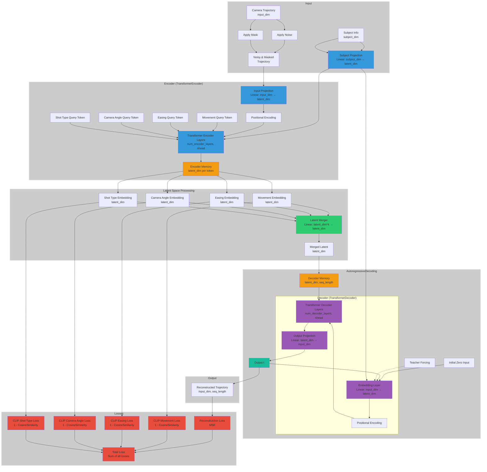

# LensCraft

This project implements an autoencoder model for camera trajectories using a multi-task architecture. The model learns to reconstruct camera movements based on subject information and initial trajectory data. In addition to producing accurate trajectory reconstructions, it generates embeddings for movement types, easing functions, camera angles, and shot types. These generated embeddings are designed to be aligned with CLIP (Contrastive Language-Image Pre-training) embeddings, allowing for better integration with language-based interfaces and multi-modal applications.

## Model Architecture



## Installation

1. Clone the repository:
   ```
   git clone https://github.com/ZahraDehghanian97/LensCraft.git
   cd LensCraft
   ```

2. Create a virtual environment (optional but recommended):
   ```
   python -m venv venv
   source venv/bin/activate  # On Windows, use `venv\Scripts\activate`
   ```

3. Install the required packages:
   ```
   pip install -r requirements.txt
   ```

## Dataset

The model expects a JSON file containing simulation data. Each simulation should include:
- Camera frames (30 frames per simulation)
- Subject information (position, size, rotation)
- Instructions (camera movement, easing, initial camera angle, initial shot type)

The `SimulationDataset` class in `data/simulation/dataset.py` handles data loading and preprocessing.

To download the dataset, use the following link:
```
https://drive.google.com/uc?id=1VT2XfBj9LFWLUBjv65dzC4bVzH0zdNDU
```
Make sure to place the downloaded dataset file in the appropriate location within your project structure.

## Usage

To train the model, run the `main.py` script with the desired arguments:
```
python main.py --data path/to/your/dataset.json --batch_size 32 --epochs 20 --lr 0.0001
```

For a full list of available arguments, run:
```
python main.py --help
```

## Training

The training process includes:
1. Data augmentation (masking and adding noise to input trajectories)
2. Teacher forcing for the autoregressive decoder
3. Gradual increase in task difficulty (noise reduction and mask ratio increase)
4. Multi-task learning (trajectory reconstruction and CLIP embedding prediction)

## Evaluation

The model is evaluated on a validation set during training. The evaluation metrics include:
1. Trajectory reconstruction loss (MSE for positions, circular distance for angles)
2. CLIP embedding similarity loss for movement types, easing functions, camera angles, and shot types

For any questions or issues, please open an issue on the GitHub repository or contact the project maintainers.